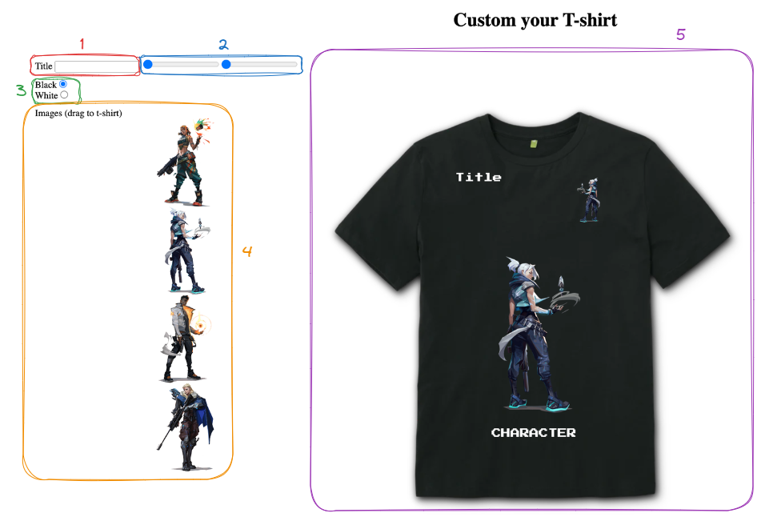

# Crea tu camiseta
Práctica del módulo profesional de desarrollo web en entorno cliente en la cual se trabajan los diferentes eventos de JS.

## 1. 📄 Enunciado
En esta práctica, los estudiantes trabajarán con los eventos de JavaScript para crear una aplicación interactiva de personalización de camisetas. El objetivo principal es que los alumnos desarrollen una interfaz donde puedan arrastrar imágenes prediseñadas sobre una camiseta y previsualizar cómo quedaría el diseño final.

La aplicación permitirá a los estudiantes arrastrar diferentes imágenes sobre una camiseta y previsualizar el diseño, este aparecerá automáticamente en dos ubicaciones diferentes:

1. **En la parte central de la camiseta**, donde la imagen será visible tal como es.
2. **En el área del pecho**, donde se mostrará una versión más pequeña de la imagen, rotada de izquierda a derecha para darle un toque estilístico diferente.

Los estudiantes deben utilizar los eventos vistos en clase y diferentes técnicas de manipulación del DOM para lograr una experiencia de usuario fluida y dinámica.

## 2. 🎯 Objetivos
- **Familiarizarse con los eventos de JavaScript**:
    - Implementar y gestionar eventos relacionados con el arrastre y la colocación de imágenes (como `dragstart`, `dragover`, `drop`).
    - Controlar otros eventos como `click` para interactuar con los elementos de la interfaz.
- **Aplicar técnicas de manipulación del DOM**:
    - Manipular elementos HTML mediante JavaScript para reflejar la interacción del usuario.
    - Posicionar dinámicamente las imágenes en la camiseta.
- **Previsualización dinámica**:
    - Mostrar la imagen arrastrada en dos posiciones distintas sobre la camiseta: en el centro, y en el pecho en versión reducida y rotada.
    - Actualizar visualmente el diseño a medida que el usuario interactúa con la interfaz.
- **Crear una interfaz intuitiva y funcional**:
    - Proporcionar una experiencia interactiva en la que los usuarios puedan seleccionar imágenes, arrastrarlas y soltarlas con facilidad.
- **Estilización y diseño básico**:
    - Usar CSS para crear una representación visual de la camiseta.
    - Aplicar estilos para la rotación y el redimensionamiento de la imagen en el área del pecho.

## 3. 🛠️ Desarrollo 
### 3.1 Diseño de la app

En este apartado, se describe el diseño de la aplicación web interactiva para la personalización de camisetas. La interfaz contará con diferentes elementos que permitirán a los usuarios personalizar tanto el diseño gráfico como el texto que aparecerá sobre la camiseta. A continuación, se detallan los elementos necesarios de la interfaz y sus funcionalidades.

1. **Input para el Título del Texto Personalizado:**
    1. Se proporcionará un campo `input` de tipo `text`, etiquetado como **"Título"**, donde los usuarios podrán ingresar un texto personalizado que aparecerá sobre la camiseta.
    2. Este campo debe permitir una longitud mínima de 0 caracteres (texto vacío) y una longitud máxima de 10 caracteres.
        
        
2. **Inputs de Tipo Rango para Posicionar el Texto:**
    1. Se añadirán dos controles de tipo `range` que permitirán ajustar la posición del texto en los ejes **X** e **Y** dentro de la camiseta.
    2. Estos controles permitirán que los usuarios muevan el texto hacia la izquierda o derecha (eje **X**) y hacia arriba o abajo (eje **Y**).
        
        
3. **Input de Tipo Radio para Seleccionar el Color de la Camiseta:**
    1. Se incluirán dos opciones mediante `input` de tipo `radio` para que el usuario pueda seleccionar el color de la camiseta.
    2. Las dos opciones disponibles serán **Blanca** y **Negra**. Al seleccionar una de estas opciones, el color de la camiseta cambiará dinámicamente.
        
        
4. **Selección de Imágenes para Diseñar la Camiseta:**
    1. El usuario podrá elegir entre un conjunto de al menos 4 imágenes prediseñadas que podrá arrastrar sobre la camiseta para personalizarla.
    2. Estas imágenes pueden representar gráficos, logotipos o ilustraciones y deben ser de fácil selección y arrastre.
    3. Las imágenes estarán dispuestas en una lista o galería.
        
        
5. Camiseta Previsualizada en la Parte Central:
    1. En la parte central de la pantalla se visualizará una imagen grande de una camiseta que servirá como lienzo para las personalizaciones.
    2. Esta camiseta cambiará de color según la selección del usuario y sobre ella se mostrarán tanto el texto personalizado como las imágenes arrastradas.
    3. La camiseta tendrá un área central para la imagen grande y un área en el pecho donde aparecerá una versión reducida y rotada de la imagen seleccionada.

Un posible diseño de la aplicación seria el siguiente:

### 3.2 Funcionamiento de la Aplicación

El usuario deberá de crear el html, css y código JS para que la aplicación realice las siguientes acciones:

- El usuario ingresa un título que aparecerá en la camiseta. Si el texto supera los 10 caracteres, se mostrará un mensaje de error.
- Mediante los sliders, se podrá ajustar la posición del texto personalizado en el eje **X** e **Y**.
- El usuario selecciona el color de la camiseta (blanco o negro) con los botones de opción.
- Se arrastra una imagen desde la lista de imágenes disponibles hacia la camiseta. La imagen aparece en dos ubicaciones: en grande en el centro de la camiseta, y en pequeña y rotada en el pecho.
- Debajo de la imagen se añade un texto con el id del elemento img que se ha arrastrado.

## 4. ✅ Calificación
1. **Diseño HTML Y CSS (2 puntos)**
2. Gestión de Eventos **(6 puntos)**
3. **Calidad del código (1 punto):**
    - Claridad, organización y reutilización de código.
    - Uso de métodos vistos en clase.
    - Comentarios.
    - Para optar a este punto es necesario obtener más de un 4 en los puntos 1,2.
4. **Entrega en tiempo y forma (1 Punto)**
    - Para optar a este punto es necesario obtener más de un 4 en los puntos 1,2.

